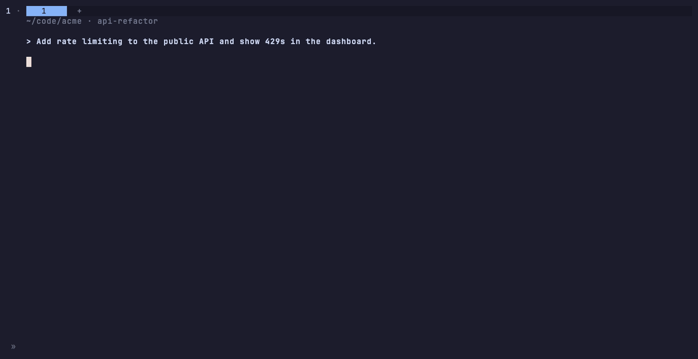

# herdr-agent-prs

**A cross-repo PR viewer for coding agents.**

Coding agents rarely stay in one repo: one task can open a PR in the API, another in the web app, and push a fix to infra. Most PR tools start from a repo. This plugin (`sebassdc.agent-prs`) starts from the **agent**: press a key on an agent's pane and a strip docks above it, listing every pull request that agent opened or pushed to, in any repo, with live CI, review and merge state. It works from any directory, including a folder of many repos that isn't a git repo itself.



## How it works

1. `herdr agent get <pane>` gives the agent's session id, which is used to find its transcript (Claude `~/.claude/projects/*/<id>.jsonl` plus its subagent and Workflow transcripts under `<id>/subagents/` and `<id>/workflows/`; Codex `~/.codex/sessions/**/*<id>*.jsonl`). If no transcript is found, it falls back to `herdr pane read` scrollback.
2. PRs are attributed to the agent only when it acted on them:
   - it ran `gh pr create|merge|edit|ready|comment|close|reopen` (the command itself, parsed per shell segment; heredoc bodies and file contents don't count) or a PR tool such as a GitHub MCP `create_pull_request`;
   - or it ran `git push` and the output shows the pushed GitHub branch. That branch is then resolved to its PRs with one batched `gh` query, so PRs opened in an earlier session still count.
   PR links in the chat are "mentions", hidden unless `show_mentioned = true`. Links in tool output (listings, scans, logs) are ignored.
3. One batched `gh api graphql` call fetches the state of every PR. It refetches when the transcript changes (2 s mtime poll), when the 60 s TTL expires (merged/closed PRs are skipped), or on `r`.

## Requirements

- **Herdr >= 0.9** on macOS or Linux (Windows is not supported).
- **`gh`** installed and logged in (`gh auth login`). For private repos, `gh` needs access to them (and SSO authorization for orgs that enforce it).
- **Agents on the same machine as the Herdr server.** Transcripts are read from local disk (`~/.claude/projects`, `~/.codex/sessions`). With `herdr --machine`, install the plugin on the remote machine where the agents run.
- **Clipboard and opener:** `pbcopy`/`open` on macOS, `xclip`/`xdg-open` on Linux.
- **Rust toolchain:** only needed when no ready-built binary matches the platform or the download fails.

## Install

### 1. Install the plugin

```sh
herdr plugin install sebassdc/herdr-agent-prs
```

Herdr clones the repo, shows a preview of the source and the build command it will run (`bash scripts/build.sh`), and asks you to confirm (`--yes` skips the prompt). The build script:

1. downloads the release binary for your platform (macOS arm64/x86_64, Linux x86_64/arm64) from the GitHub release matching `version` in `herdr-plugin.toml`;
2. verifies it against the release `SHA256SUMS`;
3. test-runs it (a no-argument run must exit 2);
4. otherwise builds from source with `cargo`.

If the build fails, Herdr does not register the plugin. Pin a version with `--ref v0.1.2`.

Herdr installs only from **public** GitHub repos. For a private fork, use the local install below.

### 2. Bind a key

Add to `~/.config/herdr/config.toml`, then run `herdr server reload-config`:

```toml
[[keys.command]]
key = "prefix+ctrl+p"
type = "plugin_action"
command = "sebassdc.agent-prs.toggle"
description = "toggle agent PR strip"
```

Any free key works. Without a binding, run **Agent PRs: toggle strip** from the Herdr action palette.

### 3. Check it

```sh
herdr plugin list --plugin sebassdc.agent-prs     # enabled, with its config dir
herdr plugin log list --plugin sebassdc.agent-prs # build and action logs
```

Focus an agent pane and press the key. The strip opens above the agent and takes focus. To see what it detects without the UI, use `herdr-agent-prs scan <pane-id>`. The binary is in the plugin root's `bin/`, which `herdr plugin list --json` shows as `plugin_root`.

### Local install (development or private fork)

```sh
git clone https://github.com/sebassdc/herdr-agent-prs ~/dev/herdr-agent-prs
cd ~/dev/herdr-agent-prs
AGENT_PRS_FROM_SOURCE=1 bash scripts/build.sh   # always compile the working tree
herdr plugin link ~/dev/herdr-agent-prs
```

`herdr plugin link` does not run build commands, so rebuild after each change. Without `AGENT_PRS_FROM_SOURCE=1`, the script skips the build when `bin/` already has the current version. It also removes the old binary before copying the new one, because macOS kills a binary that is overwritten in place.

### Update and uninstall

- **Update:** Herdr has no update command. Run `herdr plugin install sebassdc/herdr-agent-prs` again. For a linked checkout: `git pull`, then rebuild.
- **Uninstall:** `herdr plugin uninstall sebassdc.agent-prs` (or `herdr plugin unlink sebassdc.agent-prs` for a linked checkout, which keeps the files). Also remove the key binding. Local data stays in `~/.local/state/herdr-agent-prs/` until you delete it.

### Troubleshooting

| Symptom | Check |
|---|---|
| `gh CLI not found on PATH` or `gh api graphql failed` in the header | `gh auth status` in the environment the Herdr server started from |
| `not found or no access` on a row | `gh` cannot see that repo; check `gh auth` scopes and org SSO |
| `no PRs for this agent` | `herdr-agent-prs scan <pane>` shows the transcript source; press `a` to include mentions and hidden rows |
| Key does nothing | `herdr plugin list` shows the plugin enabled; the key isn't taken by another binding (avoid `alt` if a window manager owns it) |
| Strip is taller than its rows | Herdr's minimum split is 10% of the pane |

## Recording the demo

`assets/demo.gif` and `assets/screenshot.png` come from `demo/demo.tape` ([VHS](https://github.com/charmbracelet/vhs)):

```sh
brew install vhs
bash demo/record.sh
```

`record.sh` runs a throwaway Herdr: a temporary `HOME` and config, a separate session, and every `HERDR_*` variable cleared, so running it from inside Herdr cannot reach your real session. The strip shows the fake PRs in `demo/prs.json` through the `demo_file` setting, and `demo/fake-agent.sh` plays a scripted agent. No real repos, transcripts or `gh` calls are involved.

## Publishing and the Herdr marketplace

Herdr needs nothing beyond a valid `herdr-plugin.toml` (required: `id`, `name`, `version`, `min_herdr_version`; `platforms` is indexed too) in a **public** GitHub repo. There is no signing or approval step.

The [Herdr marketplace](https://herdr.dev/plugins/) indexes public, non-fork, non-archived repos that have the GitHub topic **`herdr-plugin`** and a parseable manifest on the default branch. It refreshes every 30 minutes.

Release checklist:

1. Bump `version` in `herdr-plugin.toml` and `Cargo.toml` (via PR).
2. After merge, tag `v<version>` on `main` and push the tag. `release.yml` builds the four binaries and `SHA256SUMS`.
3. Check the release assets before announcing.

## Keys (inside the strip)

The `repo#N` label is a terminal hyperlink (OSC 8): Ctrl/Cmd+click opens the PR.

`j/k` move · `o`/Enter open in browser · `y` copy URL · `x` hide (not this agent's PR) · `p` pin (this agent's PR) · `a` show all (merged, mentions, hidden) · `m` show/hide merged and closed · `r` refresh · `?` help · `q` close

Row markers: `~` only mentioned in chat (dimmed), `★` pinned by you, `✗` hidden by you. `x` and `p` toggle and are saved per agent session. They are also the ground truth for improving detection (see Telemetry).

Running the toggle with the strip focused also closes it.

## Config

`$(herdr plugin config-dir sebassdc.agent-prs)/config.toml`:

```toml
position = "top"       # top | bottom | left | right
max_rows = 8
width = 72             # left/right placement
hide_merged = true
hide_closed = true
focus_on_open = true   # false keeps focus on the agent
show_mentioned = false  # show dimmed PRs only mentioned in chat
cache_ttl_secs = 60

[telemetry]
enabled = true          # local event log, never sent anywhere
store_excerpts = false  # reserved for Jev
```

## CLI

- `herdr-agent-prs toggle [--pane ID] [--position P]`
- `herdr-agent-prs scan <pane>`: prints detected PRs and their state (debugging).
- `herdr-agent-prs stats`: summarizes the telemetry log.

## Telemetry

Local only, in `~/.local/state/herdr-agent-prs/`:

- `events.jsonl`: one JSON object per line with `ts`, `v` (plugin version) and `event`. Strip events also carry `agent`, `kind` and `session`.
  - `strip_open` / `strip_close`: `position`, `secs`.
  - `scan`: logged when counts change. `source` (transcript/scrollback) and PR counts by rule: `action`, `push`, `chat`.
  - `gh`: `kind` (status/branches), `n`, `ms`, `ok`, `error`.
  - `label`: `pr`, `label` (mine/not_mine/cleared), `reason` (the rule that attributed it), `state`.
  - `action`: `pr`, `action` (open/copy), `reason`.
  - `jev` (reserved): `pr`, `excerpt_sha256`, `excerpt_chars`, `probability`, `threshold`, `decision`, `ms`, `cost_usd`.
- `labels.json`: your `x`/`p` labels per agent session.

`stats` compares the latest label per PR with the rule that fired. It reports false positives (the rule said owned, you said not-mine) and misses (a chat mention you marked mine). These are the cases to tune the rules and Jev against.

## Limits

- Herdr clamps split ratios at 0.1, so a top/bottom strip is at least 10% of the pane height.
- Transcript support covers Claude and Codex. Other agents use scrollback only.
- Jev judging of mention-only PRs is not implemented yet (`[jev]` config and the `jev` event are reserved).

## License

MIT, see [LICENSE](LICENSE). Transcript lookup is adapted from [ChmaraX/herdr-nvim](https://github.com/ChmaraX/herdr-nvim) (MIT); see [THIRD_PARTY_NOTICES.md](THIRD_PARTY_NOTICES.md).
